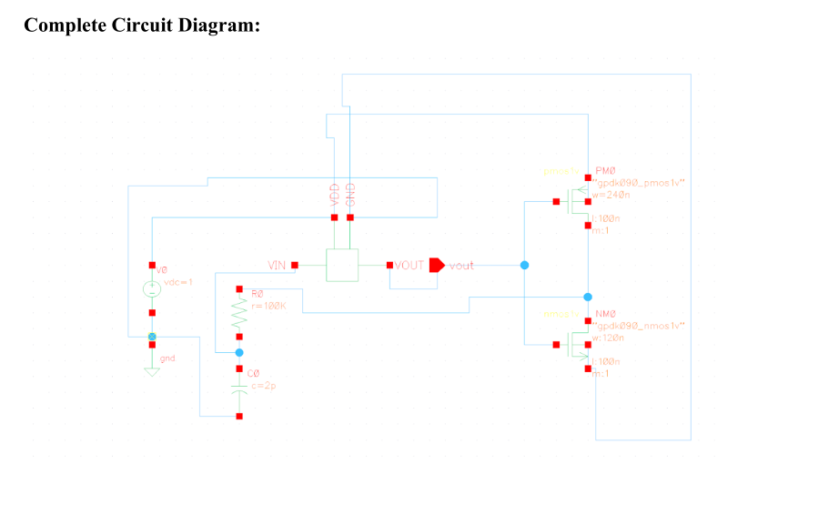
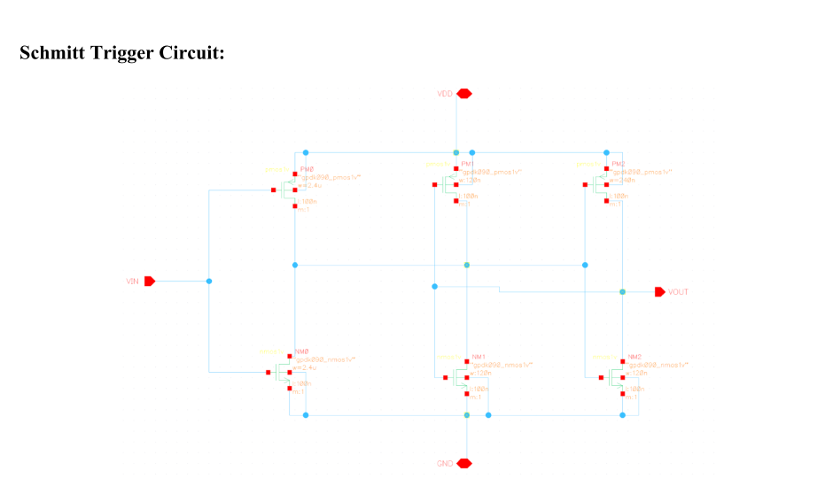
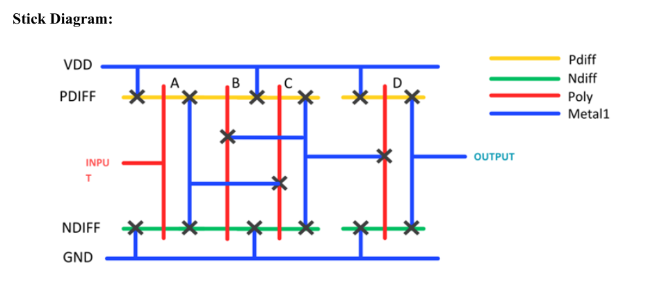
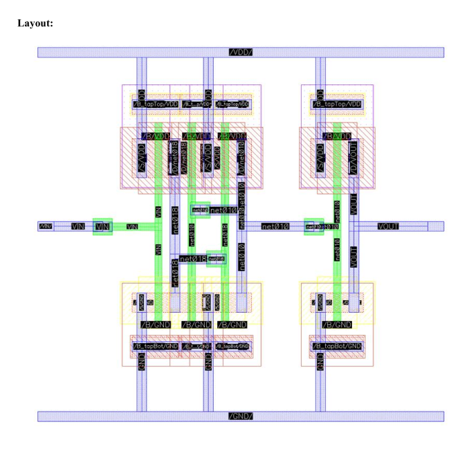

# 8:1 Analog Multiplexer Circuit

VLSI design project for an 8:1 analog multiplexer circuit.

## Preview

  

  

  

  

## Files

- `EEE 4861 Assignment.pdf`
- `1.png`
- `2.png`
- `3.png`
- `4.png`
