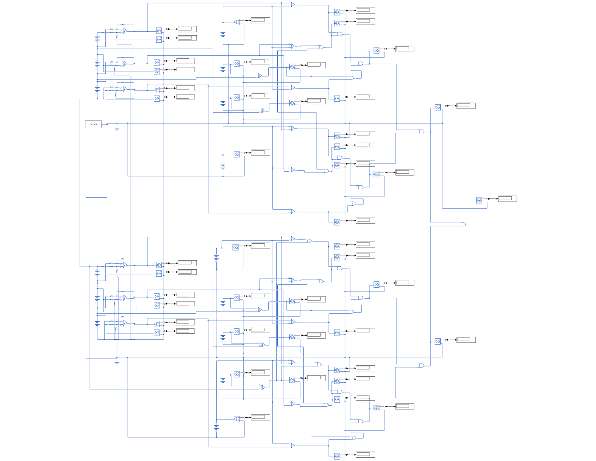
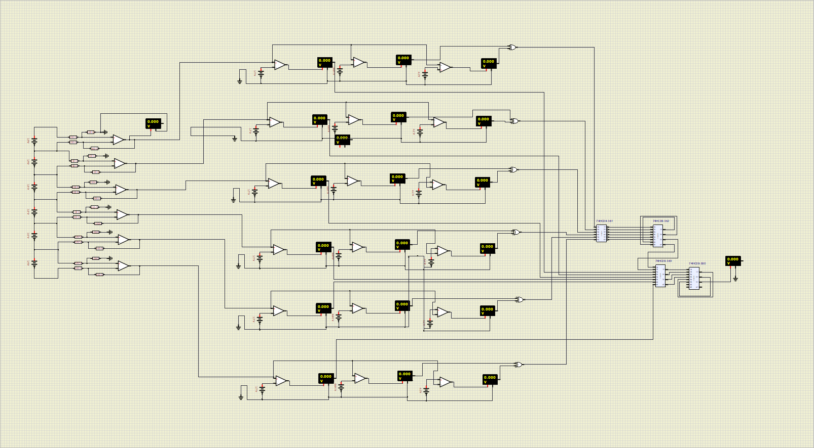
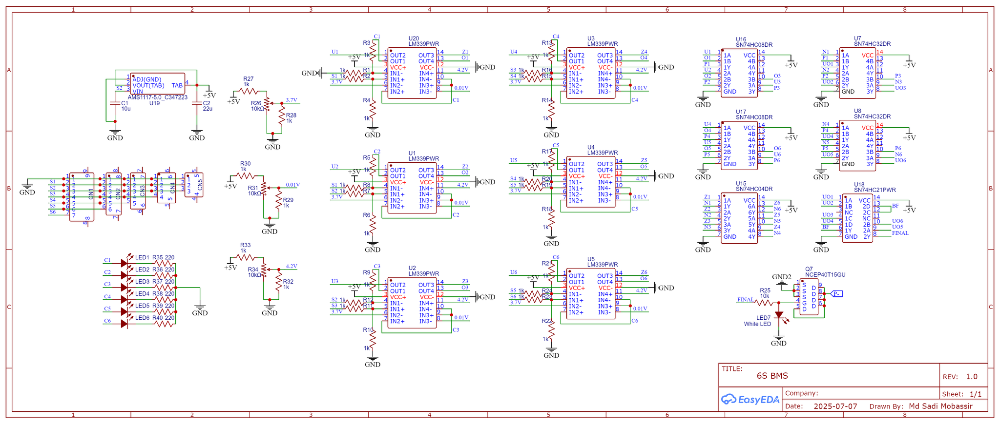
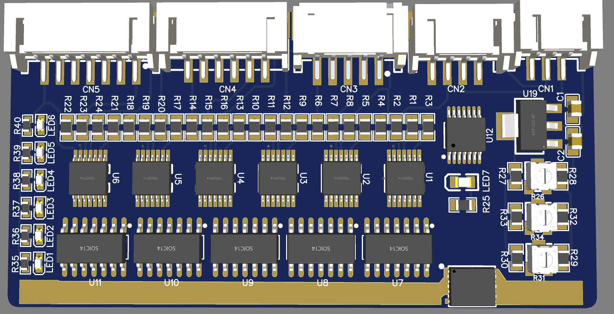
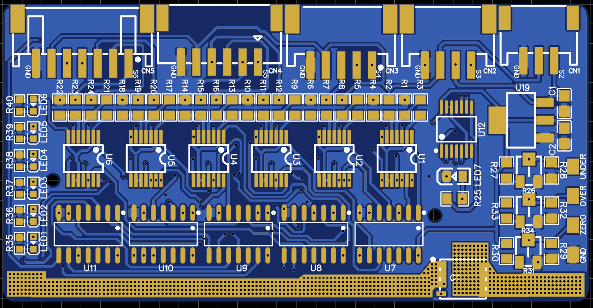
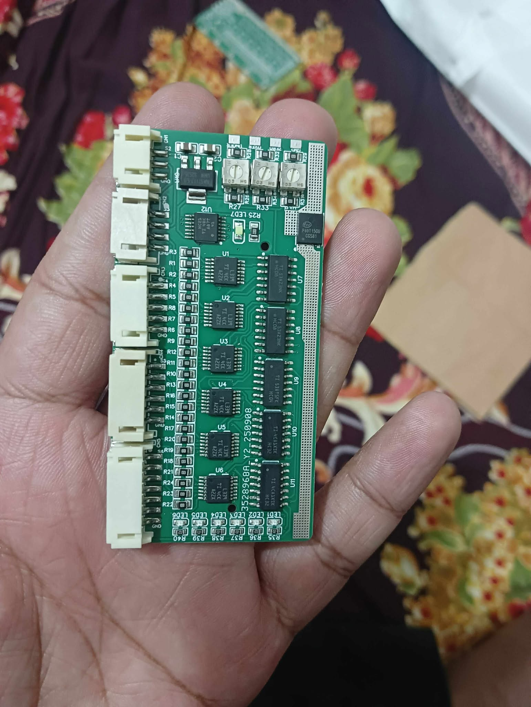
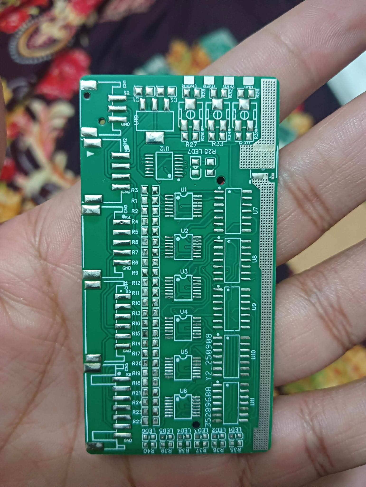

# Lipo 6s Battery Management System (BMS)

## Overview

This project is a 6S LiPo battery management system built with analog components. It uses op-amps, basic logic gates, and supporting analog circuitry to handle battery management functions without relying on a fully digital control system.

## Components Used

- Operational amplifiers (op-amps)
- Basic logic gates
- Supporting analog components
- 6S LiPo battery pack interface

## Preview

### Photos

