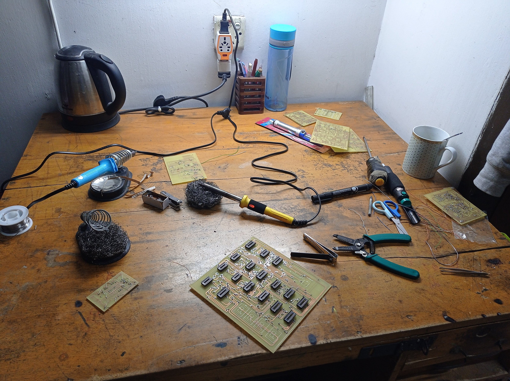
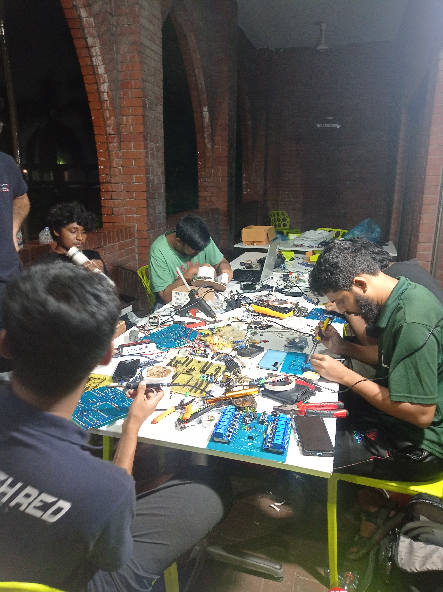
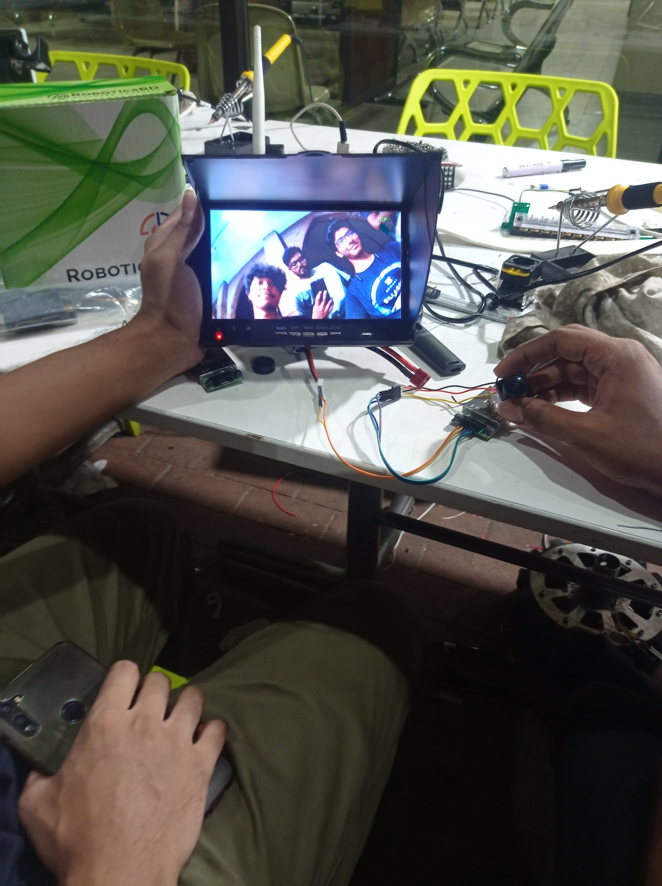
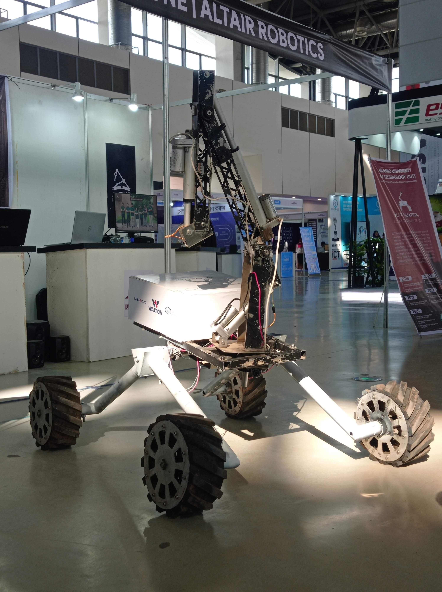
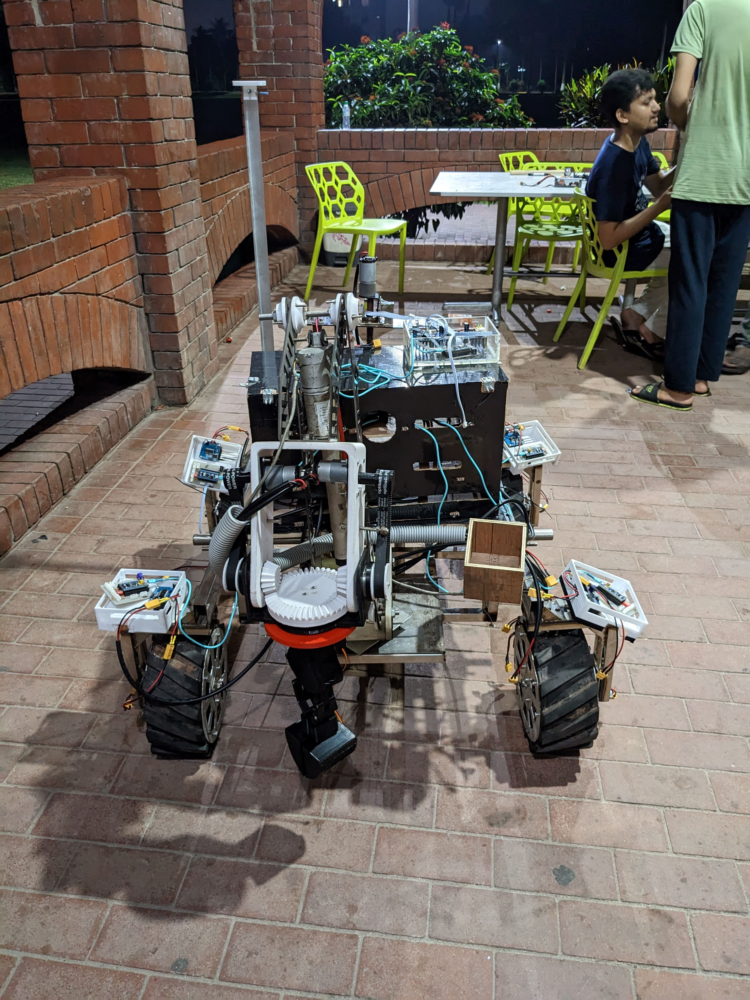
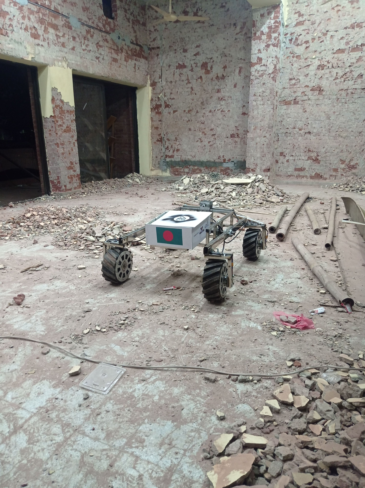
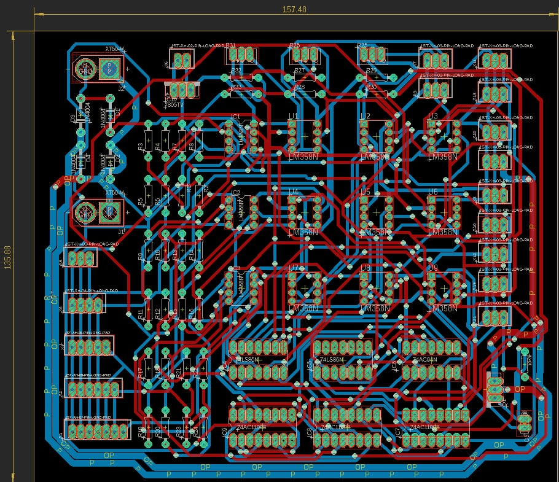
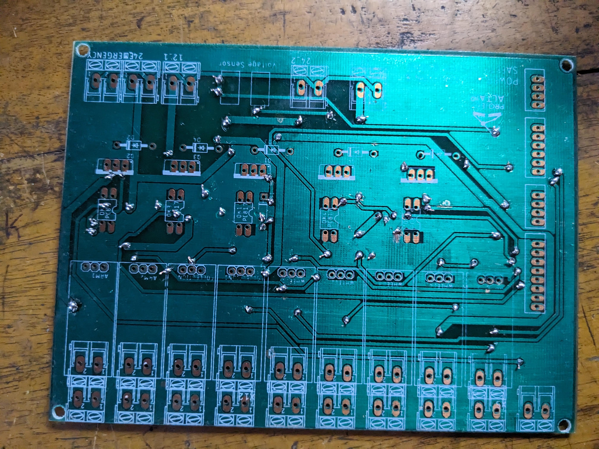

# Mars Rover

## Overview

Mars rover team designs, builds, and tests a semi-autonomous robotic system for simulated Mars exploration challenges. The rover must drive across rough terrain to GPS waypoints, operate without direct line of sight, manipulate real task panels with a robotic arm, collect and analyze soil or rock samples, deliver or retrieve objects, stream live video to a remote base station, and maintain a reliable wireless communication link for commands, sensor data, and control.

I was responsible for the electrical design and implementation, including PCB design and rover electrical integration. The PCB design files are attached in this repository. I also took part in developing the autonomous system with the software team.

## Autonomous Capability

The autonomy system is a ROS 2-based autonomous navigation stack for a Mars rover. It integrates GPS navigation, Pixhawk heading/GPS data, RealSense camera input, YOLO object detection, ArUco tag tracking, obstacle avoidance, and Arduino motor control into one modular rover system.

The stack is centered around the `local_planner`, which coordinates the rover mission flow. It follows GPS waypoints from the global planner, switches between autonomous and manual modes, starts search behaviors when needed, pauses/resumes perception nodes, and publishes velocity commands to `/cmd_vel`.

## Components Used

- ROS 2 autonomous navigation stack
- GPS waypoint navigation
- Pixhawk GPS, heading, and orientation data
- Arduino motor controller interface
- Intel RealSense camera
- YOLO object detection
- ArUco marker detection and tracking
- Depth-based obstacle avoidance
- Spiral search behavior
- Manual override through ROS 2 topics
- Gazebo and RViz simulation
- Custom ROS 2 messages and services
- Camera stream server
- Electrical design and PCB implementation
- Rover power and control PCB designs
- Robotic arm electrical design
- Wireless command, video, and sensor communication system

## Autonomous System Overview

### Main Features

- GPS waypoint navigation using mission targets from CSV
- Global and local planning for autonomous rover movement
- Pixhawk-based GPS and heading publishing
- Arduino serial interface for rover motor control
- RealSense camera support for depth sensing
- YOLO-based object detection for mission objects
- ArUco tag tracking and approach behavior
- Spiral search pattern for finding objects or tags near target locations
- Optional obstacle avoidance using depth data
- Manual override through ROS 2 topics
- Gazebo/RViz simulation support
- Custom ROS 2 messages and services for rover-specific data

### System Flow

1. Mission targets are loaded from `autonomous_nav/resource/targets.csv`.
2. `global_planner` publishes the target list as `/global_plan`.
3. `local_planner` follows each GPS waypoint using `/gps/fix` and heading data.
4. When a target is reached, the rover starts either object search or ArUco search.
5. `spiral_search` generates a GPS-based search pattern around the target area.
6. YOLO or ArUco tracking pauses the search when a target is detected and guides the rover toward it.
7. Movement commands are published to `/cmd_vel`.
8. `cmd_to_serial` sends rover velocity commands to the Arduino motor controller.

### Major Packages

- `autonomous_nav` - global planner, local planner, target handling, serial motor command bridge
- `pixhawk` - GPS, heading, and orientation publishing from Pixhawk
- `spiral_search` - GPS-based spiral search behavior
- `yolo_detection` - YOLO object detection with RealSense/USB camera input
- `aruco` - ArUco marker detection and approach control
- `obstacle_avoidance` - depth-image-based safe path and avoidance logic
- `custom_interfaces` - custom ROS 2 messages and services
- `cam_stream` - camera stream server
- `odometry` and `path_tracer` - rover path and odometry utilities
- `articubot_one` - Gazebo/RViz simulation package
- `realsense-ros` - Intel RealSense ROS 2 camera driver

## Preview

### Images

### PCB Designs

