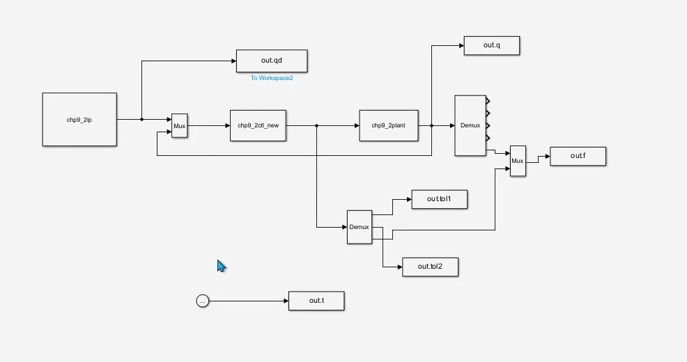
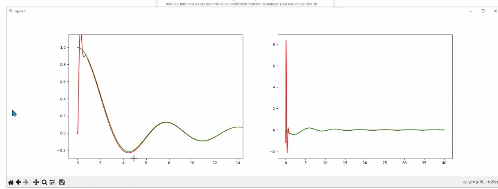

# SIMULINK Model for a Prosthetic Leg Gait Cycle

## Overview

This project simulates the gait cycle of a human leg for a prosthetic leg model. The work uses an RBF function as the standard baseline and compares it with a neural network approach to evaluate improvement and faster stability. The model was developed in Simulink, and the supporting code was written in MATLAB.

## Components Used

- MATLAB
- Simulink
- RBF function
- Neural network model

## Preview

### Photos

## File List

- `README.md`
- `model.jpeg`
- `output.png`
- `output2.jpeg`
