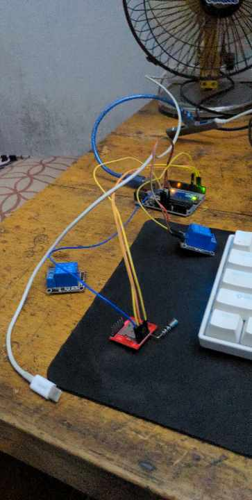

# IoT-Based Solar Panel Monitoring and Cleaning System

This project is an IoT-based system for monitoring solar panel performance and remotely cleaning the panel when power output drops. It uses voltage and current sensors to collect real-time generation data and sends the readings to the Blynk IoT mobile app.

When a drop in solar output is observed, a command is sent through a GSM SIM800L module to activate a pump and hose-based cleaning mechanism. After cleaning, the pump is stopped automatically, and improved solar power generation can be observed through the monitoring system.

## Image



## Features

- Real-time solar voltage and current monitoring
- Solar power performance tracking through Blynk IoT
- Remote pump control using GSM SIM800L
- Hose-based solar panel cleaning mechanism
- Automatic pump stop after cleaning
- Improved power generation after dust removal

## Components Used

- Arduino board
- SIM800L GSM module
- Voltage sensor
- Current sensor
- Water pump
- Hose pipe
- Relay module or pump driver circuit
- Solar panel
- Blynk IoT mobile app
- Power supply

## Working Principle

The voltage and current sensors measure the solar panel output continuously. These readings are sent to the Blynk IoT app, where the user can monitor the panel performance in real time.

If the output power drops due to dust or dirt on the panel, the user sends a command through the GSM SIM800L module. The Arduino receives the command and turns on the pump connected to the cleaning system. Water flows through the hose and cleans the panel surface.

After cleaning, the system stops the pump, and the solar panel output can be checked again through the Blynk app to confirm performance improvement.

## Code Overview

The Arduino sketch uses `SoftwareSerial` to communicate with the SIM800L module. The system reads incoming SMS or GSM commands and controls the pump through a digital output pin.

- Command `m`: turns the pump ON
- Command `n`: turns the pump OFF

The main Arduino code is available in:

```text
solar.ino
```

## Applications

- Solar panel cleaning systems
- Remote solar monitoring
- IoT-based renewable energy projects
- Smart agriculture and off-grid solar installations
