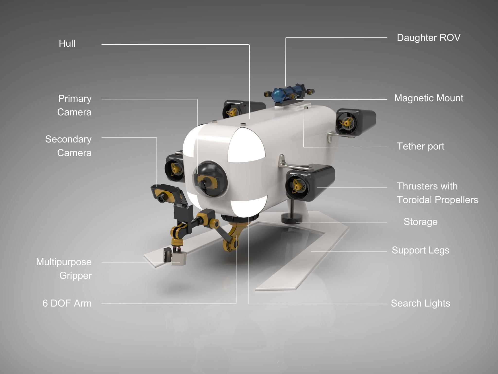
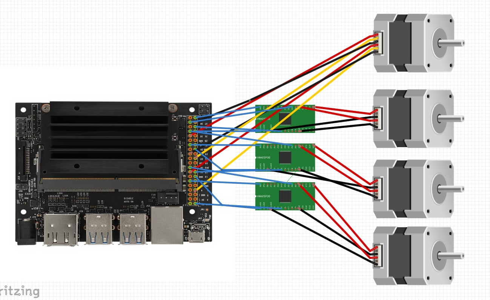

# Underwater ROV Design Project

## Overview

This project is an underwater ROV design developed for the Underwater Vehicle Design Competition organized by IIT Guwahati, India. The work focused on the electrical design of the ROV, including motor selection, power calculation, communication system design, and onboard computer design.

## Components Used

- Electrical design
- Motor selection
- Power calculation
- Communication system design
- Onboard computer design
- Underwater ROV electrical subsystem

## Preview

### Photos

### Videos

[uVDC Project Video](uVDC%20Project.mp4)

### PDFs / Documents

[Underwater ROV Presentation](underwaterROV%20presentation.pdf)

## File List

- `0f3f29dd-6ead-41b9-b59d-c03fc752d8b1.jpeg`
- `449476060_910721907766780_5549375018678518378_n.jpg`
- `README.md`
- `uVDC Project.mp4`
- `underwaterROV presentation.pdf`
